# Analysis of Proposed Amendments of the Constitution between 1787 to 2014
Published by **Michael McDonald, Dhruvak Mirani, Olaniyi Salami, Gianfranco Secondi**


## Contributions
Michael: contributed to brainstorming in part A, responsible for preprocessing in part B, data exploration in part C and assembling the document in part G

Dhruvak: contributed to brainstorming in part A, did statistical analysis in part C, and wrote the conclusion for part F

Olaniyi: contributed to brainstorming in part A, did statistical analysis in part C, worked on part D, E and the visualization of F

Gianfranco: contributed to brainstorming in part A, did statistical analysis in part C, worked on part D, E and the visualization of F


## Introduction

The objective of this project was to analyze the historical evolution of priorities and perceived problems of the American public. Specifically we wanted to answer the question _can the language and content of proposed amendments reveal the century in which they were proposed?_ Answering this question is important because it will reveal how the issues Americans deemed critical have evolved and how historical context shapes our political and legal discourse.

## Data curation

Our data is a dataset of proposed amendments from the year 1787 to 2014. This dataset provides the title/description of each amendment, the date proposed, the sponsor name, the sponsor state, the Congress number, the congress sessions, the joint resolution chamber and the joint resolution number. 

The dataset comes from the United States government's open data website data.gov, specifically from the National Archives and Records Administration who published the data. The link to the dataset is below

[Link to the dataset](https://catalog.data.gov/dataset/amending-america-proposed-amendments-to-the-united-states-constitution-1787-to-2014)


Now to transform our data to a suitable format for analysis, we first import pandas so we can convert the dataset into a dataframe

```python
import pandas as pd
df = pd.read_csv("proposed_amendments.csv", encoding="ISO-8859-1")
df
```
 <div id="df-c058efc0-f450-421e-ad28-112b02644e44" class="colab-df-container">
    <div>
<style scoped>
    .dataframe tbody tr th:only-of-type {
        vertical-align: middle;
    }

    .dataframe tbody tr th {
        vertical-align: top;
    }

    .dataframe thead th {
        text-align: right;
    }
</style>
<table border="1" class="dataframe">
  <thead>
    <tr style="text-align: right;">
      <th></th>
      <th>identifier</th>
      <th>source_code</th>
      <th>source_citation</th>
      <th>source_index_number</th>
      <th>title_or_description_from_source</th>
      <th>date_approximation</th>
      <th>year</th>
      <th>month</th>
      <th>day</th>
      <th>congress</th>
      <th>congressional_session</th>
      <th>joint_resolution_chamber</th>
      <th>joint_resolution_number</th>
      <th>sponsor_name</th>
      <th>sponsor_state_or_territory</th>
      <th>committee_of_referral</th>
      <th>last_modified</th>
    </tr>
  </thead>
  <tbody>
    <tr>
      <th>0</th>
      <td>us-nara-amending-america-000001</td>
      <td>A</td>
      <td>Ames, Herman V. The Proposed Amendments to the...</td>
      <td>1</td>
      <td>Reservation of nondelegated powers</td>
      <td>circa</td>
      <td>1788.0</td>
      <td>NaN</td>
      <td>NaN</td>
      <td>NaN</td>
      <td>NaN</td>
      <td>NaN</td>
      <td>NaN</td>
      <td>NaN</td>
      <td>NaN</td>
      <td>NaN</td>
      <td>2016-02-25T17:29:59.732-05:00</td>
    </tr>
    <tr>
      <th>1</th>
      <td>us-nara-amending-america-000002</td>
      <td>A</td>
      <td>Ames, Herman V. The Proposed Amendments to the...</td>
      <td>2</td>
      <td>Apportionment of Representatives</td>
      <td>circa</td>
      <td>1788.0</td>
      <td>NaN</td>
      <td>NaN</td>
      <td>NaN</td>
      <td>NaN</td>
      <td>NaN</td>
      <td>NaN</td>
      <td>NaN</td>
      <td>NaN</td>
      <td>NaN</td>
      <td>2016-02-25T17:29:59.732-05:00</td>
    </tr>
    <tr>
      <th>2</th>
      <td>us-nara-amending-america-000003</td>
      <td>A</td>
      <td>Ames, Herman V. The Proposed Amendments to the...</td>
      <td>3</td>
      <td>Restriction on Federal control over election o...</td>
      <td>circa</td>
      <td>1788.0</td>
      <td>NaN</td>
      <td>NaN</td>
      <td>NaN</td>
      <td>NaN</td>
      <td>NaN</td>
      <td>NaN</td>
      <td>NaN</td>
      <td>NaN</td>
      <td>NaN</td>
      <td>2016-02-25T17:29:59.732-05:00</td>
    </tr>
    <tr>
      <th>3</th>
      <td>us-nara-amending-america-000004</td>
      <td>A</td>
      <td>Ames, Herman V. The Proposed Amendments to the...</td>
      <td>4</td>
      <td>Restriction upon the levying of direct taxes</td>
      <td>circa</td>
      <td>1788.0</td>
      <td>NaN</td>
      <td>NaN</td>
      <td>NaN</td>
      <td>NaN</td>
      <td>NaN</td>
      <td>NaN</td>
      <td>NaN</td>
      <td>NaN</td>
      <td>NaN</td>
      <td>2016-02-25T17:29:59.732-05:00</td>
    </tr>
    <tr>
      <th>4</th>
      <td>us-nara-amending-america-000005</td>
      <td>A</td>
      <td>Ames, Herman V. The Proposed Amendments to the...</td>
      <td>5</td>
      <td>Commercial monopolies prohibited</td>
      <td>circa</td>
      <td>1788.0</td>
      <td>NaN</td>
      <td>NaN</td>
      <td>NaN</td>
      <td>NaN</td>
      <td>NaN</td>
      <td>NaN</td>
      <td>NaN</td>
      <td>NaN</td>
      <td>NaN</td>
      <td>2016-02-25T17:29:59.732-05:00</td>
    </tr>
    <tr>
      <th>...</th>
      <td>...</td>
      <td>...</td>
      <td>...</td>
      <td>...</td>
      <td>...</td>
      <td>...</td>
      <td>...</td>
      <td>...</td>
      <td>...</td>
      <td>...</td>
      <td>...</td>
      <td>...</td>
      <td>...</td>
      <td>...</td>
      <td>...</td>
      <td>...</td>
      <td>...</td>
    </tr>
    <tr>
      <th>11792</th>
      <td>us-nara-amending-america-011793</td>
      <td>G</td>
      <td>United States Congress. Congress.gov: Legislat...</td>
      <td>NaN</td>
      <td>A joint resolution proposing an amendment to t...</td>
      <td>NaN</td>
      <td>2013.0</td>
      <td>6.0</td>
      <td>18.0</td>
      <td>113.0</td>
      <td>NaN</td>
      <td>Senate Joint Resolution</td>
      <td>19.0</td>
      <td>Udall, Tom</td>
      <td>New Mexico</td>
      <td>Judiciary</td>
      <td>2016-02-25T17:29:59.732-05:00</td>
    </tr>
    <tr>
      <th>11793</th>
      <td>us-nara-amending-america-011794</td>
      <td>G</td>
      <td>United States Congress. Congress.gov: Legislat...</td>
      <td>NaN</td>
      <td>A joint resolution proposing a balanced budget...</td>
      <td>NaN</td>
      <td>2013.0</td>
      <td>7.0</td>
      <td>11.0</td>
      <td>113.0</td>
      <td>NaN</td>
      <td>Senate Joint Resolution</td>
      <td>20.0</td>
      <td>Udall, Tom</td>
      <td>New Mexico</td>
      <td>Judiciary</td>
      <td>2016-02-25T17:29:59.732-05:00</td>
    </tr>
    <tr>
      <th>11794</th>
      <td>us-nara-amending-america-011795</td>
      <td>G</td>
      <td>United States Congress. Congress.gov: Legislat...</td>
      <td>NaN</td>
      <td>A joint resolution proposing an amendment to t...</td>
      <td>NaN</td>
      <td>2013.0</td>
      <td>10.0</td>
      <td>11.0</td>
      <td>113.0</td>
      <td>NaN</td>
      <td>Senate Joint Resolution</td>
      <td>25.0</td>
      <td>Paul, Rand</td>
      <td>Kentucky</td>
      <td>Judiciary</td>
      <td>2016-02-25T17:29:59.732-05:00</td>
    </tr>
    <tr>
      <th>11795</th>
      <td>us-nara-amending-america-011796</td>
      <td>G</td>
      <td>United States Congress. Congress.gov: Legislat...</td>
      <td>NaN</td>
      <td>A joint resolution proposing an amendment to t...</td>
      <td>NaN</td>
      <td>2014.0</td>
      <td>3.0</td>
      <td>13.0</td>
      <td>113.0</td>
      <td>NaN</td>
      <td>Senate Joint Resolution</td>
      <td>34.0</td>
      <td>Enzi, Michael</td>
      <td>Wyoming</td>
      <td>Judiciary</td>
      <td>2016-02-25T17:29:59.732-05:00</td>
    </tr>
    <tr>
      <th>11796</th>
      <td>us-nara-amending-america-011797</td>
      <td>G</td>
      <td>United States Congress. Congress.gov: Legislat...</td>
      <td>NaN</td>
      <td>A joint resolution proposing an amendment to t...</td>
      <td>NaN</td>
      <td>2014.0</td>
      <td>6.0</td>
      <td>4.0</td>
      <td>113.0</td>
      <td>NaN</td>
      <td>Senate Joint Resolution</td>
      <td>37.0</td>
      <td>Graham, Lindsey</td>
      <td>South Carolina</td>
      <td>Judiciary</td>
      <td>2016-02-25T17:29:59.732-05:00</td>
    </tr>
  </tbody>
</table>
<p>11797 rows × 17 columns</p>
</div>
    <div class="colab-df-buttons">

  <div class="colab-df-container">
    <button class="colab-df-convert" onclick="convertToInteractive('df-c058efc0-f450-421e-ad28-112b02644e44')"
            title="Convert this dataframe to an interactive table."
            style="display:none;">

  <svg xmlns="http://www.w3.org/2000/svg" height="24px" viewBox="0 -960 960 960">
    <path d="M120-120v-720h720v720H120Zm60-500h600v-160H180v160Zm220 220h160v-160H400v160Zm0 220h160v-160H400v160ZM180-400h160v-160H180v160Zm440 0h160v-160H620v160ZM180-180h160v-160H180v160Zm440 0h160v-160H620v160Z"/>
  </svg>
    </button>

  <style>
    .colab-df-container {
      display:flex;
      gap: 12px;
    }

    .colab-df-convert {
      background-color: #E8F0FE;
      border: none;
      border-radius: 50%;
      cursor: pointer;
      display: none;
      fill: #1967D2;
      height: 32px;
      padding: 0 0 0 0;
      width: 32px;
    }

    .colab-df-convert:hover {
      background-color: #E2EBFA;
      box-shadow: 0px 1px 2px rgba(60, 64, 67, 0.3), 0px 1px 3px 1px rgba(60, 64, 67, 0.15);
      fill: #174EA6;
    }

    .colab-df-buttons div {
      margin-bottom: 4px;
    }

    [theme=dark] .colab-df-convert {
      background-color: #3B4455;
      fill: #D2E3FC;
    }

    [theme=dark] .colab-df-convert:hover {
      background-color: #434B5C;
      box-shadow: 0px 1px 3px 1px rgba(0, 0, 0, 0.15);
      filter: drop-shadow(0px 1px 2px rgba(0, 0, 0, 0.3));
      fill: #FFFFFF;
    }
  </style>

    <script>
      const buttonEl =
        document.querySelector('#df-c058efc0-f450-421e-ad28-112b02644e44 button.colab-df-convert');
      buttonEl.style.display =
        google.colab.kernel.accessAllowed ? 'block' : 'none';

      async function convertToInteractive(key) {
        const element = document.querySelector('#df-c058efc0-f450-421e-ad28-112b02644e44');
        const dataTable =
          await google.colab.kernel.invokeFunction('convertToInteractive',
                                                    [key], {});
        if (!dataTable) return;

        const docLinkHtml = 'Like what you see? Visit the ' +
          '<a target="_blank" href=https://colab.research.google.com/notebooks/data_table.ipynb>data table notebook</a>'
          + ' to learn more about interactive tables.';
        element.innerHTML = '';
        dataTable['output_type'] = 'display_data';
        await google.colab.output.renderOutput(dataTable, element);
        const docLink = document.createElement('div');
        docLink.innerHTML = docLinkHtml;
        element.appendChild(docLink);
      }
    </script>
  </div>


<div id="df-a9999aff-3d2b-4f90-a36d-ca2d42d9beec">
  <button class="colab-df-quickchart" onclick="quickchart('df-a9999aff-3d2b-4f90-a36d-ca2d42d9beec')"
            title="Suggest charts"
            style="display:none;">

<svg xmlns="http://www.w3.org/2000/svg" height="24px"viewBox="0 0 24 24"
     width="24px">
    <g>
        <path d="M19 3H5c-1.1 0-2 .9-2 2v14c0 1.1.9 2 2 2h14c1.1 0 2-.9 2-2V5c0-1.1-.9-2-2-2zM9 17H7v-7h2v7zm4 0h-2V7h2v10zm4 0h-2v-4h2v4z"/>
    </g>
</svg>
  </button>

<style>
  .colab-df-quickchart {
      --bg-color: #E8F0FE;
      --fill-color: #1967D2;
      --hover-bg-color: #E2EBFA;
      --hover-fill-color: #174EA6;
      --disabled-fill-color: #AAA;
      --disabled-bg-color: #DDD;
  }

  [theme=dark] .colab-df-quickchart {
      --bg-color: #3B4455;
      --fill-color: #D2E3FC;
      --hover-bg-color: #434B5C;
      --hover-fill-color: #FFFFFF;
      --disabled-bg-color: #3B4455;
      --disabled-fill-color: #666;
  }

  .colab-df-quickchart {
    background-color: var(--bg-color);
    border: none;
    border-radius: 50%;
    cursor: pointer;
    display: none;
    fill: var(--fill-color);
    height: 32px;
    padding: 0;
    width: 32px;
  }

  .colab-df-quickchart:hover {
    background-color: var(--hover-bg-color);
    box-shadow: 0 1px 2px rgba(60, 64, 67, 0.3), 0 1px 3px 1px rgba(60, 64, 67, 0.15);
    fill: var(--button-hover-fill-color);
  }

  .colab-df-quickchart-complete:disabled,
  .colab-df-quickchart-complete:disabled:hover {
    background-color: var(--disabled-bg-color);
    fill: var(--disabled-fill-color);
    box-shadow: none;
  }

  .colab-df-spinner {
    border: 2px solid var(--fill-color);
    border-color: transparent;
    border-bottom-color: var(--fill-color);
    animation:
      spin 1s steps(1) infinite;
  }

  @keyframes spin {
    0% {
      border-color: transparent;
      border-bottom-color: var(--fill-color);
      border-left-color: var(--fill-color);
    }
    20% {
      border-color: transparent;
      border-left-color: var(--fill-color);
      border-top-color: var(--fill-color);
    }
    30% {
      border-color: transparent;
      border-left-color: var(--fill-color);
      border-top-color: var(--fill-color);
      border-right-color: var(--fill-color);
    }
    40% {
      border-color: transparent;
      border-right-color: var(--fill-color);
      border-top-color: var(--fill-color);
    }
    60% {
      border-color: transparent;
      border-right-color: var(--fill-color);
    }
    80% {
      border-color: transparent;
      border-right-color: var(--fill-color);
      border-bottom-color: var(--fill-color);
    }
    90% {
      border-color: transparent;
      border-bottom-color: var(--fill-color);
    }
  }
</style>

  <script>
    async function quickchart(key) {
      const quickchartButtonEl =
        document.querySelector('#' + key + ' button');
      quickchartButtonEl.disabled = true;  // To prevent multiple clicks.
      quickchartButtonEl.classList.add('colab-df-spinner');
      try {
        const charts = await google.colab.kernel.invokeFunction(
            'suggestCharts', [key], {});
      } catch (error) {
        console.error('Error during call to suggestCharts:', error);
      }
      quickchartButtonEl.classList.remove('colab-df-spinner');
      quickchartButtonEl.classList.add('colab-df-quickchart-complete');
    }
    (() => {
      let quickchartButtonEl =
        document.querySelector('#df-a9999aff-3d2b-4f90-a36d-ca2d42d9beec button');
      quickchartButtonEl.style.display =
        google.colab.kernel.accessAllowed ? 'block' : 'none';
    })();
  </script>
</div>

  <div id="id_b7cc7d7e-9cc2-4851-b5fd-dce7d2c4c7fd">
    <style>
      .colab-df-generate {
        background-color: #E8F0FE;
        border: none;
        border-radius: 50%;
        cursor: pointer;
        display: none;
        fill: #1967D2;
        height: 32px;
        padding: 0 0 0 0;
        width: 32px;
      }

      .colab-df-generate:hover {
        background-color: #E2EBFA;
        box-shadow: 0px 1px 2px rgba(60, 64, 67, 0.3), 0px 1px 3px 1px rgba(60, 64, 67, 0.15);
        fill: #174EA6;
      }

      [theme=dark] .colab-df-generate {
        background-color: #3B4455;
        fill: #D2E3FC;
      }

      [theme=dark] .colab-df-generate:hover {
        background-color: #434B5C;
        box-shadow: 0px 1px 3px 1px rgba(0, 0, 0, 0.15);
        filter: drop-shadow(0px 1px 2px rgba(0, 0, 0, 0.3));
        fill: #FFFFFF;
      }
    </style>
    <button class="colab-df-generate" onclick="generateWithVariable('df')"
            title="Generate code using this dataframe."
            style="display:none;">

  <svg xmlns="http://www.w3.org/2000/svg" height="24px"viewBox="0 0 24 24"
       width="24px">
    <path d="M7,19H8.4L18.45,9,17,7.55,7,17.6ZM5,21V16.75L18.45,3.32a2,2,0,0,1,2.83,0l1.4,1.43a1.91,1.91,0,0,1,.58,1.4,1.91,1.91,0,0,1-.58,1.4L9.25,21ZM18.45,9,17,7.55Zm-12,3A5.31,5.31,0,0,0,4.9,8.1,5.31,5.31,0,0,0,1,6.5,5.31,5.31,0,0,0,4.9,4.9,5.31,5.31,0,0,0,6.5,1,5.31,5.31,0,0,0,8.1,4.9,5.31,5.31,0,0,0,12,6.5,5.46,5.46,0,0,0,6.5,12Z"/>
  </svg>
    </button>
    <script>
      (() => {
      const buttonEl =
        document.querySelector('#id_b7cc7d7e-9cc2-4851-b5fd-dce7d2c4c7fd button.colab-df-generate');
      buttonEl.style.display =
        google.colab.kernel.accessAllowed ? 'block' : 'none';

      buttonEl.onclick = () => {
        google.colab.notebook.generateWithVariable('df');
      }
      })();
    </script>
  </div>

    </div>
  </div>

Now as shown above there are a few rows that contain information on the dataset source that would not be helpful for our analysis. So we drop these columns to only have relevant information

```python
# Drop the "last edited" column
df = df.drop(df.columns[-1], axis=1)
# Drop the 'committee of referral' column since most of the values are missing and we won't be analyzing that
# also dropped source code, citation, and index number because they dont relate to the actual amendment data
df = df.drop(['committee_of_referral', 'source_code', 'source_citation', 'source_index_number'], axis=1)

df.head(5)
```


  <div id="df-902386e2-2dd7-4eb8-8c96-688335d88857" class="colab-df-container">
    <div>
<style scoped>
    .dataframe tbody tr th:only-of-type {
        vertical-align: middle;
    }

    .dataframe tbody tr th {
        vertical-align: top;
    }

    .dataframe thead th {
        text-align: right;
    }
</style>
<table border="1" class="dataframe">
  <thead>
    <tr style="text-align: right;">
      <th></th>
      <th>identifier</th>
      <th>title_or_description_from_source</th>
      <th>date_approximation</th>
      <th>year</th>
      <th>month</th>
      <th>day</th>
      <th>congress</th>
      <th>congressional_session</th>
      <th>joint_resolution_chamber</th>
      <th>joint_resolution_number</th>
      <th>sponsor_name</th>
      <th>sponsor_state_or_territory</th>
    </tr>
  </thead>
  <tbody>
    <tr>
      <th>0</th>
      <td>us-nara-amending-america-000001</td>
      <td>Reservation of nondelegated powers</td>
      <td>circa</td>
      <td>1788.0</td>
      <td>NaN</td>
      <td>NaN</td>
      <td>NaN</td>
      <td>NaN</td>
      <td>NaN</td>
      <td>NaN</td>
      <td>NaN</td>
      <td>NaN</td>
    </tr>
    <tr>
      <th>1</th>
      <td>us-nara-amending-america-000002</td>
      <td>Apportionment of Representatives</td>
      <td>circa</td>
      <td>1788.0</td>
      <td>NaN</td>
      <td>NaN</td>
      <td>NaN</td>
      <td>NaN</td>
      <td>NaN</td>
      <td>NaN</td>
      <td>NaN</td>
      <td>NaN</td>
    </tr>
    <tr>
      <th>2</th>
      <td>us-nara-amending-america-000003</td>
      <td>Restriction on Federal control over election o...</td>
      <td>circa</td>
      <td>1788.0</td>
      <td>NaN</td>
      <td>NaN</td>
      <td>NaN</td>
      <td>NaN</td>
      <td>NaN</td>
      <td>NaN</td>
      <td>NaN</td>
      <td>NaN</td>
    </tr>
    <tr>
      <th>3</th>
      <td>us-nara-amending-america-000004</td>
      <td>Restriction upon the levying of direct taxes</td>
      <td>circa</td>
      <td>1788.0</td>
      <td>NaN</td>
      <td>NaN</td>
      <td>NaN</td>
      <td>NaN</td>
      <td>NaN</td>
      <td>NaN</td>
      <td>NaN</td>
      <td>NaN</td>
    </tr>
    <tr>
      <th>4</th>
      <td>us-nara-amending-america-000005</td>
      <td>Commercial monopolies prohibited</td>
      <td>circa</td>
      <td>1788.0</td>
      <td>NaN</td>
      <td>NaN</td>
      <td>NaN</td>
      <td>NaN</td>
      <td>NaN</td>
      <td>NaN</td>
      <td>NaN</td>
      <td>NaN</td>
    </tr>
  </tbody>
</table>
</div>
    <div class="colab-df-buttons">

  <div class="colab-df-container">
    <button class="colab-df-convert" onclick="convertToInteractive('df-902386e2-2dd7-4eb8-8c96-688335d88857')"
            title="Convert this dataframe to an interactive table."
            style="display:none;">

  <svg xmlns="http://www.w3.org/2000/svg" height="24px" viewBox="0 -960 960 960">
    <path d="M120-120v-720h720v720H120Zm60-500h600v-160H180v160Zm220 220h160v-160H400v160Zm0 220h160v-160H400v160ZM180-400h160v-160H180v160Zm440 0h160v-160H620v160ZM180-180h160v-160H180v160Zm440 0h160v-160H620v160Z"/>
  </svg>
    </button>

  <style>
    .colab-df-container {
      display:flex;
      gap: 12px;
    }

    .colab-df-convert {
      background-color: #E8F0FE;
      border: none;
      border-radius: 50%;
      cursor: pointer;
      display: none;
      fill: #1967D2;
      height: 32px;
      padding: 0 0 0 0;
      width: 32px;
    }

    .colab-df-convert:hover {
      background-color: #E2EBFA;
      box-shadow: 0px 1px 2px rgba(60, 64, 67, 0.3), 0px 1px 3px 1px rgba(60, 64, 67, 0.15);
      fill: #174EA6;
    }

    .colab-df-buttons div {
      margin-bottom: 4px;
    }

    [theme=dark] .colab-df-convert {
      background-color: #3B4455;
      fill: #D2E3FC;
    }

    [theme=dark] .colab-df-convert:hover {
      background-color: #434B5C;
      box-shadow: 0px 1px 3px 1px rgba(0, 0, 0, 0.15);
      filter: drop-shadow(0px 1px 2px rgba(0, 0, 0, 0.3));
      fill: #FFFFFF;
    }
  </style>

    <script>
      const buttonEl =
        document.querySelector('#df-902386e2-2dd7-4eb8-8c96-688335d88857 button.colab-df-convert');
      buttonEl.style.display =
        google.colab.kernel.accessAllowed ? 'block' : 'none';

      async function convertToInteractive(key) {
        const element = document.querySelector('#df-902386e2-2dd7-4eb8-8c96-688335d88857');
        const dataTable =
          await google.colab.kernel.invokeFunction('convertToInteractive',
                                                    [key], {});
        if (!dataTable) return;

        const docLinkHtml = 'Like what you see? Visit the ' +
          '<a target="_blank" href=https://colab.research.google.com/notebooks/data_table.ipynb>data table notebook</a>'
          + ' to learn more about interactive tables.';
        element.innerHTML = '';
        dataTable['output_type'] = 'display_data';
        await google.colab.output.renderOutput(dataTable, element);
        const docLink = document.createElement('div');
        docLink.innerHTML = docLinkHtml;
        element.appendChild(docLink);
      }
    </script>
  </div>


<div id="df-70256812-bc82-4cbb-8b81-b4c797f5186c">
  <button class="colab-df-quickchart" onclick="quickchart('df-70256812-bc82-4cbb-8b81-b4c797f5186c')"
            title="Suggest charts"
            style="display:none;">

<svg xmlns="http://www.w3.org/2000/svg" height="24px"viewBox="0 0 24 24"
     width="24px">
    <g>
        <path d="M19 3H5c-1.1 0-2 .9-2 2v14c0 1.1.9 2 2 2h14c1.1 0 2-.9 2-2V5c0-1.1-.9-2-2-2zM9 17H7v-7h2v7zm4 0h-2V7h2v10zm4 0h-2v-4h2v4z"/>
    </g>
</svg>
  </button>

<style>
  .colab-df-quickchart {
      --bg-color: #E8F0FE;
      --fill-color: #1967D2;
      --hover-bg-color: #E2EBFA;
      --hover-fill-color: #174EA6;
      --disabled-fill-color: #AAA;
      --disabled-bg-color: #DDD;
  }

  [theme=dark] .colab-df-quickchart {
      --bg-color: #3B4455;
      --fill-color: #D2E3FC;
      --hover-bg-color: #434B5C;
      --hover-fill-color: #FFFFFF;
      --disabled-bg-color: #3B4455;
      --disabled-fill-color: #666;
  }

  .colab-df-quickchart {
    background-color: var(--bg-color);
    border: none;
    border-radius: 50%;
    cursor: pointer;
    display: none;
    fill: var(--fill-color);
    height: 32px;
    padding: 0;
    width: 32px;
  }

  .colab-df-quickchart:hover {
    background-color: var(--hover-bg-color);
    box-shadow: 0 1px 2px rgba(60, 64, 67, 0.3), 0 1px 3px 1px rgba(60, 64, 67, 0.15);
    fill: var(--button-hover-fill-color);
  }

  .colab-df-quickchart-complete:disabled,
  .colab-df-quickchart-complete:disabled:hover {
    background-color: var(--disabled-bg-color);
    fill: var(--disabled-fill-color);
    box-shadow: none;
  }

  .colab-df-spinner {
    border: 2px solid var(--fill-color);
    border-color: transparent;
    border-bottom-color: var(--fill-color);
    animation:
      spin 1s steps(1) infinite;
  }

  @keyframes spin {
    0% {
      border-color: transparent;
      border-bottom-color: var(--fill-color);
      border-left-color: var(--fill-color);
    }
    20% {
      border-color: transparent;
      border-left-color: var(--fill-color);
      border-top-color: var(--fill-color);
    }
    30% {
      border-color: transparent;
      border-left-color: var(--fill-color);
      border-top-color: var(--fill-color);
      border-right-color: var(--fill-color);
    }
    40% {
      border-color: transparent;
      border-right-color: var(--fill-color);
      border-top-color: var(--fill-color);
    }
    60% {
      border-color: transparent;
      border-right-color: var(--fill-color);
    }
    80% {
      border-color: transparent;
      border-right-color: var(--fill-color);
      border-bottom-color: var(--fill-color);
    }
    90% {
      border-color: transparent;
      border-bottom-color: var(--fill-color);
    }
  }
</style>

  <script>
    async function quickchart(key) {
      const quickchartButtonEl =
        document.querySelector('#' + key + ' button');
      quickchartButtonEl.disabled = true;  // To prevent multiple clicks.
      quickchartButtonEl.classList.add('colab-df-spinner');
      try {
        const charts = await google.colab.kernel.invokeFunction(
            'suggestCharts', [key], {});
      } catch (error) {
        console.error('Error during call to suggestCharts:', error);
      }
      quickchartButtonEl.classList.remove('colab-df-spinner');
      quickchartButtonEl.classList.add('colab-df-quickchart-complete');
    }
    (() => {
      let quickchartButtonEl =
        document.querySelector('#df-70256812-bc82-4cbb-8b81-b4c797f5186c button');
      quickchartButtonEl.style.display =
        google.colab.kernel.accessAllowed ? 'block' : 'none';
    })();
  </script>
</div>

    </div>
  </div>


And with that the dataset is now ready for analysis!

## Exploratory Data Analysis

```python
#total number of null values per feature
df.isnull().sum()
```

<div>
<style scoped>
    .dataframe tbody tr th:only-of-type {
        vertical-align: middle;
    }

    .dataframe tbody tr th {
        vertical-align: top;
    }

    .dataframe thead th {
        text-align: right;
    }
</style>
<table border="1" class="dataframe">
  <thead>
    <tr style="text-align: right;">
      <th></th>
      <th>0</th>
    </tr>
  </thead>
  <tbody>
    <tr>
      <th>identifier</th>
      <td>0</td>
    </tr>
    <tr>
      <th>source_code</th>
      <td>30</td>
    </tr>
    <tr>
      <th>source_citation</th>
      <td>30</td>
    </tr>
    <tr>
      <th>source_index_number</th>
      <td>1143</td>
    </tr>
    <tr>
      <th>title_or_description_from_source</th>
      <td>3</td>
    </tr>
    <tr>
      <th>date_approximation</th>
      <td>11134</td>
    </tr>
    <tr>
      <th>year</th>
      <td>5</td>
    </tr>
    <tr>
      <th>month</th>
      <td>678</td>
    </tr>
    <tr>
      <th>day</th>
      <td>678</td>
    </tr>
    <tr>
      <th>congress</th>
      <td>873</td>
    </tr>
    <tr>
      <th>congressional_session</th>
      <td>9388</td>
    </tr>
    <tr>
      <th>joint_resolution_chamber</th>
      <td>1964</td>
    </tr>
    <tr>
      <th>joint_resolution_number</th>
      <td>1965</td>
    </tr>
    <tr>
      <th>sponsor_name</th>
      <td>832</td>
    </tr>
    <tr>
      <th>sponsor_state_or_territory</th>
      <td>901</td>
    </tr>
    <tr>
      <th>committee_of_referral</th>
      <td>7894</td>
    </tr>
    <tr>
      <th>last_modified</th>
      <td>0</td>
    </tr>
  </tbody>
</table>
</div><br><label><b>dtype:</b> int64</label>

```python
# total number of samples
df.shape[0]
```


    11797

```python
#notes/observations

# 1. there seems to be a correlation between century and missing data. In amendments from the 1700's they're missing a lot of data from most categories
# 2. equal rights seems to be a hot topic for proposed amendments. out of almost 12k amendments over 1000 involve equal rights
print(df['title_or_description_from_source'].str.contains("equal rights", case=False, na=False).sum())
# 3. similarly almost 1500 of the 12k or so proposed amendments involve congress's powers/abilities, which is a hot topic for Americans
print(df['title_or_description_from_source'].str.contains("congress", case=False, na=False).sum())
```

    1135
    1440


### FIRST STATISTICAL METHOD

This section will do an Anova test.

Assume α=0.05.

H0: The century the US is in does not have an impact on the amendments proposed.

H1: The century the US is in does have an impact on the amendments proposed.


```python
# Create the new column and assign an entry for each row based on centuries.
df["century"] = "unknown"
for index,row in df.iterrows():
  if df.loc[index, "year"] >= 1783 and df.loc[index, "year"] <= 1799:
    df.loc[index,"century"] = "18th century"
  elif df.loc[index, "year"] >= 1800 and df.loc[index, "year"] <= 1899:
    df.loc[index,"century"] = "19th century"
  elif df.loc[index, "year"] >= 1900 and df.loc[index, "year"] <= 1999:
    df.loc[index,"century"] = "20th century"
  else:
    df.loc[index, "century"] = "21st century"

# Filter columns based on their centuries.
df_18th = df[df["century"] == "18th century"]
df_19th = df[df["century"] == "19th century"]
df_20th = df[df["century"] == "20th century"]
df_21st = df[df["century"] ==  "21st century"]
print(df_18th)
print(df_19th)
print(df_20th)
print(df_21st)
```

                              identifier  \
    0    us-nara-amending-america-000001   
    1    us-nara-amending-america-000002   
    2    us-nara-amending-america-000003   
    3    us-nara-amending-america-000004   
    4    us-nara-amending-america-000005   
    ..                               ...   
    340  us-nara-amending-america-000341   
    341  us-nara-amending-america-000342   
    342  us-nara-amending-america-000343   
    343  us-nara-amending-america-000344   
    344  us-nara-amending-america-000345   
    
                          title_or_description_from_source date_approximation  \
    0                   Reservation of nondelegated powers              circa   
    1                     Apportionment of Representatives              circa   
    2    Restriction on Federal control over election o...              circa   
    3         Restriction upon the levying of direct taxes              circa   
    4                     Commercial monopolies prohibited              circa   
    ..                                                 ...                ...   
    340           Qualifications necessary for eligibility              circa   
    341           Qualifications necessary for eligibility                NaN   
    342  Choice of: Electors to designate persons voted...                NaN   
    343  Choice of: Electors to designate persons voted...                NaN   
    344  Choice of: Electors to designate persons voted...                NaN   
    
           year  month   day  congress congressional_session  \
    0    1788.0    NaN   NaN       NaN                   NaN   
    1    1788.0    NaN   NaN       NaN                   NaN   
    2    1788.0    NaN   NaN       NaN                   NaN   
    3    1788.0    NaN   NaN       NaN                   NaN   
    4    1788.0    NaN   NaN       NaN                   NaN   
    ..      ...    ...   ...       ...                   ...   
    340  1798.0    NaN   NaN       NaN                   NaN   
    341  1789.0   10.0   2.0       NaN                   NaN   
    342  1799.0    2.0  16.0       5.0                     3   
    343  1799.0    2.0  28.0       NaN                   NaN   
    344  1799.0    NaN   NaN       NaN                   NaN   
    
        joint_resolution_chamber  joint_resolution_number sponsor_name  \
    0                        NaN                      NaN          NaN   
    1                        NaN                      NaN          NaN   
    2                        NaN                      NaN          NaN   
    3                        NaN                      NaN          NaN   
    4                        NaN                      NaN          NaN   
    ..                       ...                      ...          ...   
    340                      NaN                      NaN          NaN   
    341                      NaN                      NaN          NaN   
    342                      NaN                      NaN       Foster   
    343                      NaN                      NaN          NaN   
    344                      NaN                      NaN          NaN   
    
        sponsor_state_or_territory       century  
    0                          NaN  18th century  
    1                          NaN  18th century  
    2                          NaN  18th century  
    3                          NaN  18th century  
    4                          NaN  18th century  
    ..                         ...           ...  
    340                        NaN  18th century  
    341                        NaN  18th century  
    342              New Hampshire  18th century  
    343                        NaN  18th century  
    344                        NaN  18th century  
    
    [345 rows x 13 columns]
                               identifier  \
    345   us-nara-amending-america-000346   
    346   us-nara-amending-america-000347   
    347   us-nara-amending-america-000348   
    348   us-nara-amending-america-000349   
    349   us-nara-amending-america-000350   
    ...                               ...   
    2245  us-nara-amending-america-002246   
    2246  us-nara-amending-america-002247   
    2247  us-nara-amending-america-002248   
    2248  us-nara-amending-america-002249   
    2249  us-nara-amending-america-002250   
    
                           title_or_description_from_source date_approximation  \
    345        Judges restricted from holding other offices                NaN   
    346   Choice of: Electors to designate persons voted...                NaN   
    347                  Judges ineligible to other offices                NaN   
    348       Choice of: Electors to be chosen by districts                NaN   
    349           Representatives to be chosen by districts                NaN   
    ...                                                 ...                ...   
    2245                               To prohibit polygamy                NaN   
    2246                                         Income tax                NaN   
    2247                   Relative to marriage and divorce                NaN   
    2248                 Popular election of Federal judges                NaN   
    2249                               To prohibit polygamy                NaN   
    
            year  month   day  congress congressional_session  \
    345   1800.0    2.0   3.0       6.0                     1   
    346   1800.0    2.0   4.0       6.0                     1   
    347   1800.0    2.0  13.0       6.0                     1   
    348   1800.0    3.0  14.0       6.0                     1   
    349   1800.0    3.0  14.0       6.0                     1   
    ...      ...    ...   ...       ...                   ...   
    2245  1899.0   12.0  11.0      56.0                     1   
    2246  1899.0   12.0  14.0      56.0                     1   
    2247  1899.0   12.0  14.0      56.0                     1   
    2248  1899.0   12.0  20.0      56.0                     1   
    2249  1899.0   12.0  20.0      56.0                     1   
    
         joint_resolution_chamber  joint_resolution_number  sponsor_name  \
    345                       NaN                      NaN      Pinckney   
    346                       NaN                      NaN           NaN   
    347                       NaN                      NaN  Livingston\n   
    348                       NaN                      NaN      Nicholas   
    349                       NaN                      NaN      Nicholas   
    ...                       ...                      ...           ...   
    2245   House Joint Resolution                     69.0     Showalter   
    2246   House Joint Resolution                     78.0      Williams   
    2247  Senate Joint Resolution                     40.0          Kyle   
    2248  Senate Joint Resolution                     47.0        Butler   
    2249   House Joint Resolution                     93.0      Shafroth   
    
         sponsor_state_or_territory       century  
    345              South Carolina  19th century  
    346                         NaN  19th century  
    347                    New York  19th century  
    348                    Virginia  19th century  
    349                    Virginia  19th century  
    ...                         ...           ...  
    2245               Pennsylvania  19th century  
    2246                Mississippi  19th century  
    2247               South Dakota  19th century  
    2248             North Carolina  19th century  
    2249                   Colorado  19th century  
    
    [1899 rows x 13 columns]
                                identifier  \
    2074   us-nara-amending-america-002075   
    2250   us-nara-amending-america-002251   
    2251   us-nara-amending-america-002252   
    2252   us-nara-amending-america-002253   
    2253   us-nara-amending-america-002254   
    ...                                ...   
    11260  us-nara-amending-america-011261   
    11261  us-nara-amending-america-011262   
    11262  us-nara-amending-america-011263   
    11263  us-nara-amending-america-011264   
    11264  us-nara-amending-america-011265   
    
                            title_or_description_from_source date_approximation  \
    2074                        Popular election of Senators                NaN   
    2250                                          Income tax                NaN   
    2251   Prohibiting the annexation of noncontiguous te...                NaN   
    2252                                          Income tax                NaN   
    2253                      To regulate or suppress trusts                NaN   
    ...                                                  ...                ...   
    11260  A joint resolution proposing an amendment to t...                NaN   
    11261  A joint resolution proposing an amendment to t...                NaN   
    11262  A joint resolution proposing an amendment to t...                NaN   
    11263  A joint resolution proposing an amendment to t...                NaN   
    11264  A joint resolution proposing an amendment to t...                NaN   
    
             year  month   day  congress congressional_session  \
    2074   1983.0    9.0   6.0      53.0                     1   
    2250   1900.0    1.0   3.0      56.0                     1   
    2251   1900.0    1.0   3.0      56.0                     1   
    2252   1900.0    1.0   3.0      56.0                     1   
    2253   1900.0    1.0   3.0      56.0                     1   
    ...       ...    ...   ...       ...                   ...   
    11260  1999.0    3.0  17.0     106.0                   NaN   
    11261  1999.0    3.0  18.0     106.0                   NaN   
    11262  1999.0    3.0  25.0     106.0                   NaN   
    11263  1999.0    8.0   2.0     106.0                   NaN   
    11264  1999.0    8.0   5.0     106.0                   NaN   
    
          joint_resolution_chamber  joint_resolution_number        sponsor_name  \
    2074    House Joint Resolution                     13.0               Bryan   
    2250   Senate Joint Resolution                     49.0              Butler   
    2251    House Joint Resolution                     98.0              Cooney   
    2252    House Joint Resolution                     99.0           Snodgrass   
    2253    House Joint Resolution                    100.0            Bromwell   
    ...                        ...                      ...                 ...   
    11260  Senate Joint Resolution                     14.0     Hatch, Orrin G.   
    11261  Senate Joint Resolution                     15.0     Coverdell, Paul   
    11262  Senate Joint Resolution                     17.0  Shelby, Richard C.   
    11263  Senate Joint Resolution                     30.0  Kennedy, Edward M.   
    11264  Senate Joint Resolution                     31.0       Allard, Wayne   
    
          sponsor_state_or_territory       century  
    2074                    Nebraska  20th century  
    2250              North Carolina  20th century  
    2251                    Missouri  20th century  
    2252                   Tennessee  20th century  
    2253                        Ohio  20th century  
    ...                          ...           ...  
    11260                       Utah  20th century  
    11261                    Georgia  20th century  
    11262                    Alabama  20th century  
    11263              Massachusetts  20th century  
    11264                   Colorado  20th century  
    
    [9003 rows x 13 columns]
                                identifier  \
    435    us-nara-amending-america-000436   
    436    us-nara-amending-america-000437   
    437    us-nara-amending-america-000438   
    479    us-nara-amending-america-000480   
    525    us-nara-amending-america-000526   
    ...                                ...   
    11792  us-nara-amending-america-011793   
    11793  us-nara-amending-america-011794   
    11794  us-nara-amending-america-011795   
    11795  us-nara-amending-america-011796   
    11796  us-nara-amending-america-011797   
    
                            title_or_description_from_source date_approximation  \
    435                                       Tax on exports                NaN   
    436                         Internal improvements, roads                NaN   
    437                        Internal improvements, canals                NaN   
    479             Election of Representatives by districts                NaN   
    525    Congress prohibited from establishing a nation...              circa   
    ...                                                  ...                ...   
    11792  A joint resolution proposing an amendment to t...                NaN   
    11793  A joint resolution proposing a balanced budget...                NaN   
    11794  A joint resolution proposing an amendment to t...                NaN   
    11795  A joint resolution proposing an amendment to t...                NaN   
    11796  A joint resolution proposing an amendment to t...                NaN   
    
             year  month   day  congress congressional_session  \
    435       NaN    NaN   NaN       NaN                   NaN   
    436       NaN    NaN   NaN       NaN                   NaN   
    437       NaN    NaN   NaN       NaN                   NaN   
    479       NaN    NaN   NaN       NaN                   NaN   
    525       NaN    1.0   5.0      16.0                     1   
    ...       ...    ...   ...       ...                   ...   
    11792  2013.0    6.0  18.0     113.0                   NaN   
    11793  2013.0    7.0  11.0     113.0                   NaN   
    11794  2013.0   10.0  11.0     113.0                   NaN   
    11795  2014.0    3.0  13.0     113.0                   NaN   
    11796  2014.0    6.0   4.0     113.0                   NaN   
    
          joint_resolution_chamber  joint_resolution_number     sponsor_name  \
    435                        NaN                      NaN              NaN   
    436                        NaN                      NaN              NaN   
    437                        NaN                      NaN              NaN   
    479                        NaN                      NaN              NaN   
    525                        NaN                      NaN           Lowrie   
    ...                        ...                      ...              ...   
    11792  Senate Joint Resolution                     19.0       Udall, Tom   
    11793  Senate Joint Resolution                     20.0       Udall, Tom   
    11794  Senate Joint Resolution                     25.0       Paul, Rand   
    11795  Senate Joint Resolution                     34.0    Enzi, Michael   
    11796  Senate Joint Resolution                     37.0  Graham, Lindsey   
    
          sponsor_state_or_territory       century  
    435                          NaN  21st century  
    436                          NaN  21st century  
    437                          NaN  21st century  
    479                          NaN  21st century  
    525                 Pennsylvania  21st century  
    ...                          ...           ...  
    11792                 New Mexico  21st century  
    11793                 New Mexico  21st century  
    11794                   Kentucky  21st century  
    11795                    Wyoming  21st century  
    11796             South Carolina  21st century  
    
    [550 rows x 13 columns]


```python
# displaying the p-value of applying the ANOVA test. We need to gather the total amount of amendments passed for each year.
df_18th_count = df_18th["year"].value_counts()
df_19th_count = df_19th["year"].value_counts()
df_20th_count = df_20th["year"].value_counts()
df_21st_count = df_21st["year"].value_counts()


scipy.f_oneway(df_18th_count,df_19th_count,df_20th_count,df_21st_count)

```


    F_onewayResult(statistic=14.45090424771137, pvalue=1.2864530210399601e-08)


Note that the p-value from above is basically 0. Since it was mentioned that α=0.05, then we reject the null hypothesis. This is because p-value is a measure utilized to quantify the strength of evidence against the null hypothesis. In this case, since the p-value, or 0.016, is less than 0.05, then the p-value has strong enough evidence to reject the null hypothesis. In other words, the century the US is in does indeed have an impact on the amendments proposed.


```python
# Construct a dataframe for each century.

df_18th_count = pd.DataFrame(df_18th_count)
df_18th_count.columns = ["count"]
df_19th_count = pd.DataFrame(df_19th_count)
df_19th_count.columns = ["count"]
df_20th_count = pd.DataFrame(df_20th_count)
df_20th_count.columns = ["count"]
df_21st_count = pd.DataFrame(df_21st_count)
df_21st_count.columns = ["count"]

df_18th_count["century"] = "18th century"
df_19th_count["century"] = "19th century"
df_20th_count["century"] = "20th century"
df_21st_count["century"] = "21st century"


plt.title("Anova Test")
plt.xlabel('Each century of America')
plt.ylabel('Number of Amendments Proposed')


plt.boxplot([df_18th_count["count"],df_19th_count["count"],df_20th_count["count"],df_21st_count["count"]], labels=["18th century","19th century", "20th century", "21st century"])

plt.show()
```


    
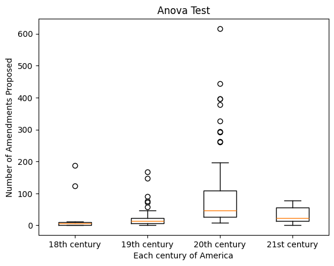
    


The datapoints you see on the graph above represent findings about the number of amendments proposed for a given century. For example, in the 20th century, there's an outlier where 600 amendments were proposed! In other words, one year in the 20th century proposed 600 amendments. In the 18th century, their outlier was 200 amendments proposed instead. Through a box and whiskers plot, you can also see the median and estimate the mean number of amendments proposed for each century. For example, the mean and median for the 18th century is rather close to 0, which can be seen isn't the case for the 20th century.

Here are separate graphs that demonstrates the distribution for each century.


```python
plt.title("Histogram of 18th century")
plt.xlabel('Number of Amendments Proposed')
plt.ylabel('Frequency of the Number of Amendments Proposed')

df_18th_count["count"].hist()


```


    <Axes: title={'center': 'Histogram of 18th century'}, xlabel='Number of Amendments Proposed', ylabel='Frequency of the Number of Amendments Proposed'>


    
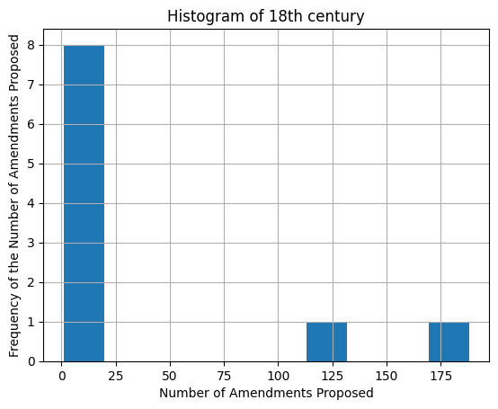
    


```python
plt.title("Histogram of 19th century")
plt.xlabel('Number of Amendments Proposed')
plt.ylabel('Frequency of the Number of Amendments Proposed')

df_19th_count["count"].hist()
```


    <Axes: title={'center': 'Histogram of 19th century'}, xlabel='Number of Amendments Proposed', ylabel='Frequency of the Number of Amendments Proposed'>


    
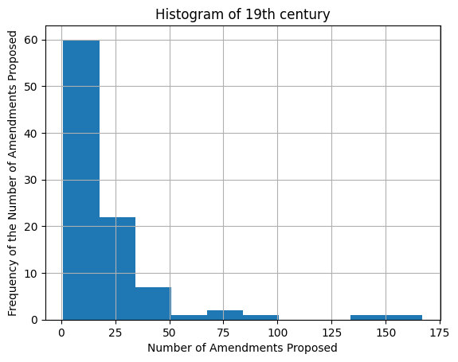
    


```python

plt.title("Histogram of 20th century")
plt.xlabel('Number of Amendments Proposed')
plt.ylabel('Frequency of the Number of Amendments Proposed')
df_20th_count["count"].hist()
```


    <Axes: title={'center': 'Histogram of 20th century'}, xlabel='Number of Amendments Proposed', ylabel='Frequency of the Number of Amendments Proposed'>


    
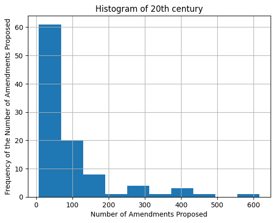
    


```python
plt.title("Histogram of 21st century")
plt.xlabel('Number of Amendments Proposed')
plt.ylabel('Frequency of the Number of Amendments Proposed')

df_21st_count["count"].hist()
```


    <Axes: title={'center': 'Histogram of 21st century'}, xlabel='Number of Amendments Proposed', ylabel='Frequency of the Number of Amendments Proposed'>


    
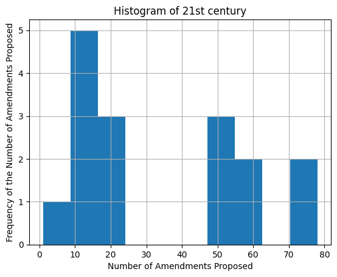
    


Most of these graphs paint a distribution in which it is skewed to the right. This is an important observation as it means the mean is greater than the median. This reinforces observations made in the box and whiskers plot, as for example the 20th century is skewed to the right, especially due to its high outliers. Additionally, because of sheer amount of amendments proposed in the 20th century, this demonstrates that the 20th century can overshadow other centuries or have a significant influence on any overall analysis done when considering all the centuries at once.

Naturally, because we are doing an ANOVA test with multiple groups and rejected the null hypothesis, it begs the question: which groups significantly differ from one another?


```python
# Because we rejected the null hypothesis and we are dealing with more than two groups, let's do a post hoc test analysis

stat, p_eighteen_v_nineteen = scipy.f_oneway(df_18th_count["count"],df_19th_count["count"])
stat, p_eighteen_v_twenty = scipy.f_oneway(df_18th_count["count"],df_20th_count["count"])
stat, p_eighteen_v_twentyone = scipy.f_oneway(df_18th_count["count"],df_21st_count["count"])

stat, p_nineteen_v_twenty = scipy.f_oneway(df_19th_count["count"],df_20th_count["count"])
stat, p_nineteen_v_twentyone = scipy.f_oneway(df_19th_count["count"],df_21st_count["count"])


stat, p_twenty_v_twentyone= scipy.f_oneway(df_20th_count["count"],df_21st_count["count"])


list_of_comparsions = ["18 and 19","18 and 20","18 and 21","19 and 20", "19 and 21", "20 and 21"]
list_of_p_values = [p_eighteen_v_nineteen,p_eighteen_v_twenty,p_eighteen_v_twentyone,p_nineteen_v_twenty,p_nineteen_v_twentyone,p_twenty_v_twentyone]


post_anova_df = pd.DataFrame()
post_anova_df["comparisons"] = list_of_comparsions
post_anova_df["p_value"] = list_of_p_values
post_anova_df["significant difference"] = post_anova_df["p_value"] <= 0.05
post_anova_df


```


  <div id="df-8eeb6bdb-d7dd-4c6d-8dc3-fc50a6407b85" class="colab-df-container">
    <div>
<style scoped>
    .dataframe tbody tr th:only-of-type {
        vertical-align: middle;
    }

    .dataframe tbody tr th {
        vertical-align: top;
    }

    .dataframe thead th {
        text-align: right;
    }
</style>
<table border="1" class="dataframe">
  <thead>
    <tr style="text-align: right;">
      <th></th>
      <th>comparisons</th>
      <th>p_value</th>
      <th>significant difference</th>
    </tr>
  </thead>
  <tbody>
    <tr>
      <th>0</th>
      <td>18 and 19</td>
      <td>1.683100e-01</td>
      <td>False</td>
    </tr>
    <tr>
      <th>1</th>
      <td>18 and 20</td>
      <td>1.117457e-01</td>
      <td>False</td>
    </tr>
    <tr>
      <th>2</th>
      <td>18 and 21</td>
      <td>9.809253e-01</td>
      <td>False</td>
    </tr>
    <tr>
      <th>3</th>
      <td>19 and 20</td>
      <td>3.442635e-09</td>
      <td>True</td>
    </tr>
    <tr>
      <th>4</th>
      <td>19 and 21</td>
      <td>4.630885e-02</td>
      <td>True</td>
    </tr>
    <tr>
      <th>5</th>
      <td>20 and 21</td>
      <td>4.061128e-02</td>
      <td>True</td>
    </tr>
  </tbody>
</table>
</div>
    <div class="colab-df-buttons">

  <div class="colab-df-container">
    <button class="colab-df-convert" onclick="convertToInteractive('df-8eeb6bdb-d7dd-4c6d-8dc3-fc50a6407b85')"
            title="Convert this dataframe to an interactive table."
            style="display:none;">

  <svg xmlns="http://www.w3.org/2000/svg" height="24px" viewBox="0 -960 960 960">
    <path d="M120-120v-720h720v720H120Zm60-500h600v-160H180v160Zm220 220h160v-160H400v160Zm0 220h160v-160H400v160ZM180-400h160v-160H180v160Zm440 0h160v-160H620v160ZM180-180h160v-160H180v160Zm440 0h160v-160H620v160Z"/>
  </svg>
    </button>

  <style>
    .colab-df-container {
      display:flex;
      gap: 12px;
    }

    .colab-df-convert {
      background-color: #E8F0FE;
      border: none;
      border-radius: 50%;
      cursor: pointer;
      display: none;
      fill: #1967D2;
      height: 32px;
      padding: 0 0 0 0;
      width: 32px;
    }

    .colab-df-convert:hover {
      background-color: #E2EBFA;
      box-shadow: 0px 1px 2px rgba(60, 64, 67, 0.3), 0px 1px 3px 1px rgba(60, 64, 67, 0.15);
      fill: #174EA6;
    }

    .colab-df-buttons div {
      margin-bottom: 4px;
    }

    [theme=dark] .colab-df-convert {
      background-color: #3B4455;
      fill: #D2E3FC;
    }

    [theme=dark] .colab-df-convert:hover {
      background-color: #434B5C;
      box-shadow: 0px 1px 3px 1px rgba(0, 0, 0, 0.15);
      filter: drop-shadow(0px 1px 2px rgba(0, 0, 0, 0.3));
      fill: #FFFFFF;
    }
  </style>

    <script>
      const buttonEl =
        document.querySelector('#df-8eeb6bdb-d7dd-4c6d-8dc3-fc50a6407b85 button.colab-df-convert');
      buttonEl.style.display =
        google.colab.kernel.accessAllowed ? 'block' : 'none';

      async function convertToInteractive(key) {
        const element = document.querySelector('#df-8eeb6bdb-d7dd-4c6d-8dc3-fc50a6407b85');
        const dataTable =
          await google.colab.kernel.invokeFunction('convertToInteractive',
                                                    [key], {});
        if (!dataTable) return;

        const docLinkHtml = 'Like what you see? Visit the ' +
          '<a target="_blank" href=https://colab.research.google.com/notebooks/data_table.ipynb>data table notebook</a>'
          + ' to learn more about interactive tables.';
        element.innerHTML = '';
        dataTable['output_type'] = 'display_data';
        await google.colab.output.renderOutput(dataTable, element);
        const docLink = document.createElement('div');
        docLink.innerHTML = docLinkHtml;
        element.appendChild(docLink);
      }
    </script>
  </div>


<div id="df-c1366420-06b7-46c2-bfd9-0838ecf9b3bf">
  <button class="colab-df-quickchart" onclick="quickchart('df-c1366420-06b7-46c2-bfd9-0838ecf9b3bf')"
            title="Suggest charts"
            style="display:none;">

<svg xmlns="http://www.w3.org/2000/svg" height="24px"viewBox="0 0 24 24"
     width="24px">
    <g>
        <path d="M19 3H5c-1.1 0-2 .9-2 2v14c0 1.1.9 2 2 2h14c1.1 0 2-.9 2-2V5c0-1.1-.9-2-2-2zM9 17H7v-7h2v7zm4 0h-2V7h2v10zm4 0h-2v-4h2v4z"/>
    </g>
</svg>
  </button>

<style>
  .colab-df-quickchart {
      --bg-color: #E8F0FE;
      --fill-color: #1967D2;
      --hover-bg-color: #E2EBFA;
      --hover-fill-color: #174EA6;
      --disabled-fill-color: #AAA;
      --disabled-bg-color: #DDD;
  }

  [theme=dark] .colab-df-quickchart {
      --bg-color: #3B4455;
      --fill-color: #D2E3FC;
      --hover-bg-color: #434B5C;
      --hover-fill-color: #FFFFFF;
      --disabled-bg-color: #3B4455;
      --disabled-fill-color: #666;
  }

  .colab-df-quickchart {
    background-color: var(--bg-color);
    border: none;
    border-radius: 50%;
    cursor: pointer;
    display: none;
    fill: var(--fill-color);
    height: 32px;
    padding: 0;
    width: 32px;
  }

  .colab-df-quickchart:hover {
    background-color: var(--hover-bg-color);
    box-shadow: 0 1px 2px rgba(60, 64, 67, 0.3), 0 1px 3px 1px rgba(60, 64, 67, 0.15);
    fill: var(--button-hover-fill-color);
  }

  .colab-df-quickchart-complete:disabled,
  .colab-df-quickchart-complete:disabled:hover {
    background-color: var(--disabled-bg-color);
    fill: var(--disabled-fill-color);
    box-shadow: none;
  }

  .colab-df-spinner {
    border: 2px solid var(--fill-color);
    border-color: transparent;
    border-bottom-color: var(--fill-color);
    animation:
      spin 1s steps(1) infinite;
  }

  @keyframes spin {
    0% {
      border-color: transparent;
      border-bottom-color: var(--fill-color);
      border-left-color: var(--fill-color);
    }
    20% {
      border-color: transparent;
      border-left-color: var(--fill-color);
      border-top-color: var(--fill-color);
    }
    30% {
      border-color: transparent;
      border-left-color: var(--fill-color);
      border-top-color: var(--fill-color);
      border-right-color: var(--fill-color);
    }
    40% {
      border-color: transparent;
      border-right-color: var(--fill-color);
      border-top-color: var(--fill-color);
    }
    60% {
      border-color: transparent;
      border-right-color: var(--fill-color);
    }
    80% {
      border-color: transparent;
      border-right-color: var(--fill-color);
      border-bottom-color: var(--fill-color);
    }
    90% {
      border-color: transparent;
      border-bottom-color: var(--fill-color);
    }
  }
</style>

  <script>
    async function quickchart(key) {
      const quickchartButtonEl =
        document.querySelector('#' + key + ' button');
      quickchartButtonEl.disabled = true;  // To prevent multiple clicks.
      quickchartButtonEl.classList.add('colab-df-spinner');
      try {
        const charts = await google.colab.kernel.invokeFunction(
            'suggestCharts', [key], {});
      } catch (error) {
        console.error('Error during call to suggestCharts:', error);
      }
      quickchartButtonEl.classList.remove('colab-df-spinner');
      quickchartButtonEl.classList.add('colab-df-quickchart-complete');
    }
    (() => {
      let quickchartButtonEl =
        document.querySelector('#df-c1366420-06b7-46c2-bfd9-0838ecf9b3bf button');
      quickchartButtonEl.style.display =
        google.colab.kernel.accessAllowed ? 'block' : 'none';
    })();
  </script>
</div>

  <div id="id_a396e841-c3cd-420f-a652-14b64b76c30a">
    <style>
      .colab-df-generate {
        background-color: #E8F0FE;
        border: none;
        border-radius: 50%;
        cursor: pointer;
        display: none;
        fill: #1967D2;
        height: 32px;
        padding: 0 0 0 0;
        width: 32px;
      }

      .colab-df-generate:hover {
        background-color: #E2EBFA;
        box-shadow: 0px 1px 2px rgba(60, 64, 67, 0.3), 0px 1px 3px 1px rgba(60, 64, 67, 0.15);
        fill: #174EA6;
      }

      [theme=dark] .colab-df-generate {
        background-color: #3B4455;
        fill: #D2E3FC;
      }

      [theme=dark] .colab-df-generate:hover {
        background-color: #434B5C;
        box-shadow: 0px 1px 3px 1px rgba(0, 0, 0, 0.15);
        filter: drop-shadow(0px 1px 2px rgba(0, 0, 0, 0.3));
        fill: #FFFFFF;
      }
    </style>
    <button class="colab-df-generate" onclick="generateWithVariable('post_anova_df')"
            title="Generate code using this dataframe."
            style="display:none;">

  <svg xmlns="http://www.w3.org/2000/svg" height="24px"viewBox="0 0 24 24"
       width="24px">
    <path d="M7,19H8.4L18.45,9,17,7.55,7,17.6ZM5,21V16.75L18.45,3.32a2,2,0,0,1,2.83,0l1.4,1.43a1.91,1.91,0,0,1,.58,1.4,1.91,1.91,0,0,1-.58,1.4L9.25,21ZM18.45,9,17,7.55Zm-12,3A5.31,5.31,0,0,0,4.9,8.1,5.31,5.31,0,0,0,1,6.5,5.31,5.31,0,0,0,4.9,4.9,5.31,5.31,0,0,0,6.5,1,5.31,5.31,0,0,0,8.1,4.9,5.31,5.31,0,0,0,12,6.5,5.46,5.46,0,0,0,6.5,12Z"/>
  </svg>
    </button>
    <script>
      (() => {
      const buttonEl =
        document.querySelector('#id_a396e841-c3cd-420f-a652-14b64b76c30a button.colab-df-generate');
      buttonEl.style.display =
        google.colab.kernel.accessAllowed ? 'block' : 'none';

      buttonEl.onclick = () => {
        google.colab.notebook.generateWithVariable('post_anova_df');
      }
      })();
    </script>
  </div>

    </div>
  </div>


We can see above that out of all the possible combination of groups, only 19 and 20 and 19 and 21 had a significant difference. This is because their p-values were less than 0.05. The other groups had larger p-values and thus did not have a significant difference due to a lack of strong evidence to suggest otherwise.


### SECOND STATISTICAL METHOD

This section will do a z-test.

Assume α=0.05.

H₀: The mean freqeuncy of words used in a random sample of each century will be the same as the frequency overall.

Hₐ: The mean freqeuncy of words used in a random sample of each century will diverge from the frequency overall.


Defining methods, meant to count the frequencies/store them in a dictionary, and plot those dictionaries respectively.


```python
from collections import defaultdict

def word_counter(text_series):
    word_counts = defaultdict(int) #default value for any key will be 0, no need to initialize each word
    for text in text_series:
        if pd.notna(text): # checking if cell is not empty
            for word in str(text).lower().split(): # split the string into words
                word_counts[word] += 1
    return word_counts

def plot_words(curr_df, title):
  title_word_counts = word_counter(curr_df['title_or_description_from_source'])
  #print(title_word_counts) #uncomment to see the output
  remove_words = ["constitution","of", "the", "to", "and", "for", "in", "by", "a", "on", "an", "united", "states", "amendment", "or", "on", "be", "proposing", "that", "with", "any", "from", "etc", "not", "as", "which", "may"]
  for word in remove_words:
      if word in title_word_counts:
          del title_word_counts[word]
  # Sort the word counts in descending order
  sorted_word_counts = sorted(title_word_counts.items(), key=lambda item: item[1], reverse=True)

  # Select the top N words (e.g., top 20)
  top_n = 50
  top_words = sorted_word_counts[:top_n]

  # Extract words and counts for plotting
  words = [word for word, count in top_words]
  counts = [count for word, count in top_words]

  # Create the bar graph
  plt.figure(figsize=(12, 6))  # Adjust figure size as needed
  plt.bar(words, counts)
  plt.xlabel('Words')
  plt.ylabel('Frequency')
  plt.title(title + ': Top {} Most Frequent Words in Amendment Titles'.format(top_n))
  plt.xticks(rotation=45, ha='right')  # Rotate x-axis labels for better readability
  plt.tight_layout()  # Adjust layout to prevent labels from overlapping
  plt.show()
  return title_word_counts

```

This first section just shows some interesting analysis on the frequencies of words used in proposing amendments, excluding those that are extremely common such as 'the', 'to', 'of', etc.

This is done using samples as each century has significantly different number of amendments proposed so we wanted to normalize for that difference (though this does not do so for centuries where amendment titles were more verbose).


```python
counts_overall = plot_words(df.sample(n=300, random_state = 42), "Overall")
counts_18th = plot_words(df_18th.sample(n = 300, random_state = 42), "18th Century")
counts_19th = plot_words(df_19th.sample(n = 300, random_state = 42), "19th Century")
counts_20th = plot_words(df_20th.sample(n = 300, random_state = 42), "20th Century")
counts_21st = plot_words(df_21st.sample(n = 300, random_state = 42), "21st Century")
```


    
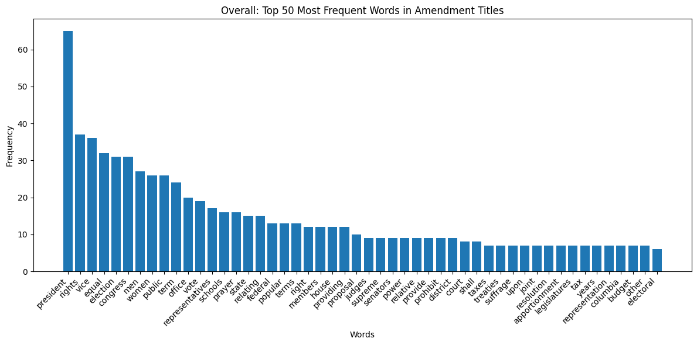
    


    
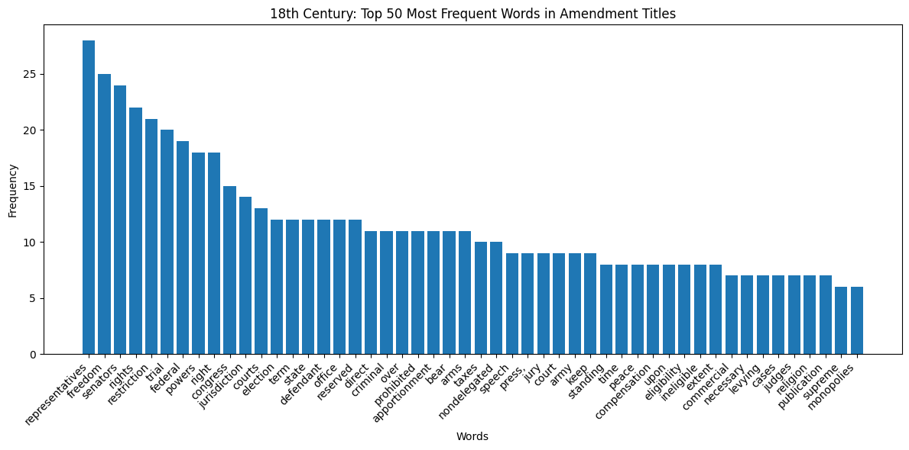
    


    
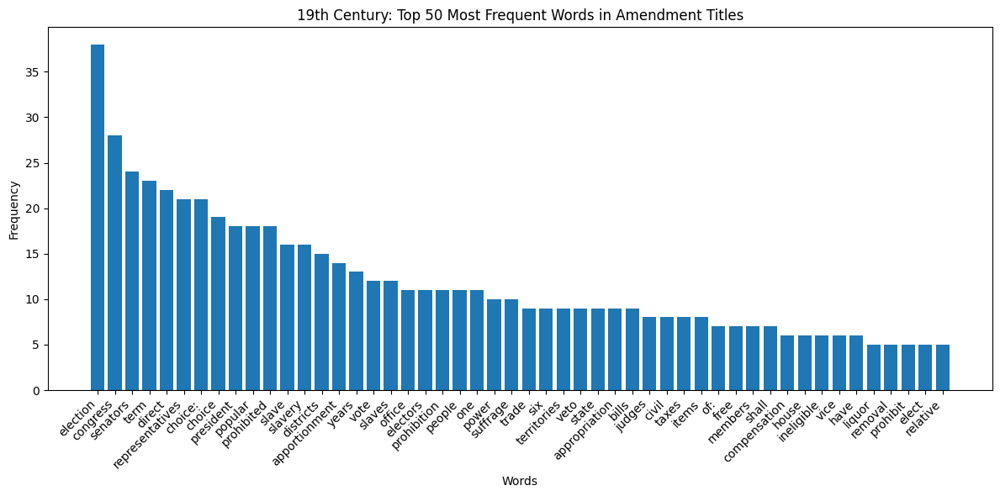
    


    
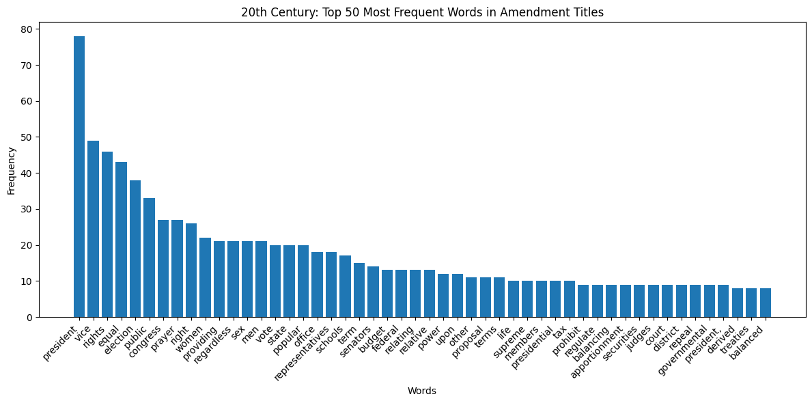
    


    
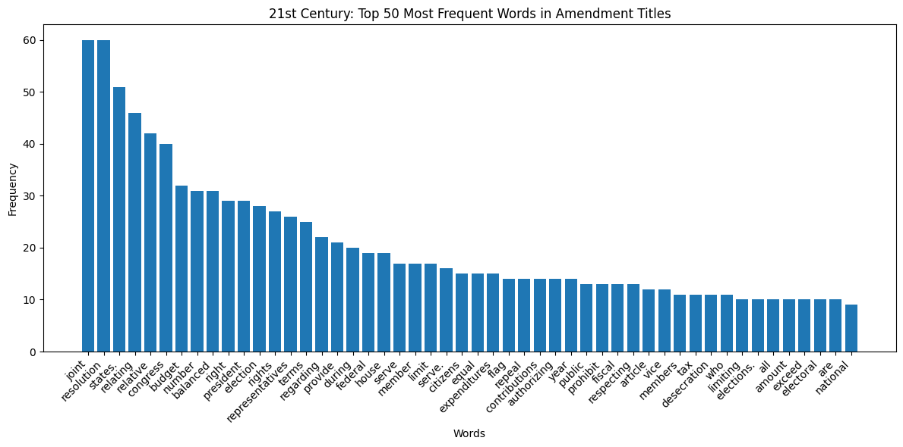
    


Seeing that the graphs are significantly different from each other, we would like to see if the frequency of words in each century is significantly different from the frequency overall. This could help reveal if any century most defines the rate of words used across the history of the United States.


```python
import statsmodels.stats.weightstats as stats

sample_overall = list(counts_overall.values())
sample_18th = list(counts_18th.values())
sample_19th = list(counts_19th.values())
sample_20th = list(counts_20th.values())
sample_21st = list(counts_21st.values())
arr = [["18th",sample_18th], ["19th",sample_19th], ["20th",sample_20th], ["21st",sample_21st]]
for sample in arr:
  z_statistic, p_value = stats.ztest(sample_overall, sample[1], value = 0, alternative = "two-sided")
  print(sample[0]+ " century: " + str(p_value))
```

    18th century: 0.06493297171735281
    19th century: 0.8916706866988514
    20th century: 0.11109392714786906
    21st century: 2.764096532922159e-06


Seeing that we have p-value of 0.0005 for the 21st century, we can reject the null hypothesis while failing to reject the null hypothesis for the rest. This may lead us to conclude some things. One, that we have proposed more amendments in the 21st century so the average frequency is most reflected by recent times. Two, we may have used a similar distribution of words with one topic potentially being predominant overall and in the 21st century, or being more evenly spread in both cases. Or three, that the data is skewed heavily towards the 21st century since we have better records of the titles of proposed amendments.

It is also interesting to note that the 19th century is most different from the overall mean so perhaps during that time events may have lead to amendment proposition to stray from the overall/norm.

### THIRD STATISTICAL METHOD

This section will do a chi-square test.

Assume α=0.05.

H₀: The distribution of proposed amendments is uniform across all states or territories (i.e., each state or territory proposes an equal number of amendments).

Hₐ: The distribution of proposed amendments is not uniform across all states or territories (i.e., some states or territories propose significantly more or fewer amendments than others).


```python
# Drop rows where sponsor_state_or_territory is NaN
df_clean = df.dropna(subset=['sponsor_state_or_territory'])

# Create a frequency table for the sponsor_state_or_territory column
state_counts = df_clean['sponsor_state_or_territory'].value_counts()

# Perform the chi-square test for the hypothesis
chi2_stat, p_val = scipy.chisquare(state_counts)

# Display the chi-square statistic and p-value
print(f"Chi-square statistic: {chi2_stat}")
print(f"P-value: {p_val}")
```

    Chi-square statistic: 9734.045704845816
    P-value: 0.0


At a significance level of α=0.05, the p-value of 0.0 is far below the threshold of 0.05. Therefore, we reject the null hypothesis (H₀), which posits that the distribution of proposed amendments is uniform across states or territories.

This means there is strong statistical evidence that certain states or territories propose significantly more amendments than others. The large chi-square statistic (9734.05) reinforces the conclusion that the observed distribution differs substantially from the expected uniform distribution.

We will conduct a post-hoc analysis to determine which states vary the most from the expected distribution.


```python
# Total number of proposed amendments
total_amendments = state_counts.sum()

# Number of states or territories
num_states = len(state_counts)

# Expected frequency assuming uniform distribution
expected_frequency = total_amendments / num_states

# Calculate standardized residuals for each state
standardized_residuals = (state_counts - expected_frequency) / (expected_frequency ** 0.5)

# Display states with the largest positive or negative deviations
print("Standardized residuals:")
print(standardized_residuals.sort_values(ascending=False))
```

    Standardized residuals:
    sponsor_state_or_territory
    New York            56.242295
    Texas               29.948956
    California          29.042290
    Pennsylvania        26.810494
    Illinois            22.486391
    Ohio                21.161262
    Florida             17.325364
    Michigan             9.862798
    Massachusetts        9.444337
    Missouri             8.886388
    Indiana              8.258695
    Alabama              3.376643
    New Jersey           3.376643
    Virginia             2.888438
    South Carolina       1.354079
    Tennessee            1.284335
    Wisconsin            1.214591
    North Carolina       0.935617
    Georgia              0.168437
    Kansas              -0.110537
    Mississippi         -0.459255
    Maryland            -0.738229
    Minnesota           -0.947460
    Louisiana           -1.086947
    Kentucky            -1.156691
    Oklahoma            -2.760794
    Iowa                -2.970025
    Arkansas            -5.271564
    Washington          -5.550538
    Arizona             -5.899256
    New Hampshire       -6.108487
    Connecticut         -6.387461
    Colorado            -6.457205
    Oregon              -6.596692
    Nebraska            -6.805923
    West Virginia       -7.503359
    South Dakota        -8.479770
    North Dakota        -8.689000
    Idaho               -9.177206
    Utah                -9.177206
    Maine               -9.804898
    Delaware           -10.432590
    Vermont            -10.572078
    Montana            -10.641821
    Rhode Island       -10.920796
    Wyoming            -10.920796
    New Mexico         -11.409001
    Nevada             -11.478745
    Hawaii             -12.176181
    Washington, D.C.   -12.943360
    Alaska             -13.013104
    Virgin Islands     -13.571053
    Guam               -13.850027
    Name: count, dtype: float64


The standardized residuals show that certain states, like New York, Texas, and California, have significantly more proposed amendments than expected, with New York having the highest positive residual (56.24). This means these states are the most active in proposing amendments, deviating far above the average.

On the other hand, states and territories such as Guam, Virgin Islands, Alaska, and Washington, D.C., have large negative residuals, indicating they propose significantly fewer amendments than expected. The most notable deviation on the lower end is Guam, with a standardized residual of -13.85. These results highlight substantial variation in amendment proposal activity across states and territories.

Next, we will visualize these findings.


```python
# Sort the standardized residuals for better visualization
standardized_residuals_sorted = standardized_residuals.sort_values(ascending=False)

# Create a bar plot to visualize the standardized residuals
plt.figure(figsize=(10, 8))
plt.barh(standardized_residuals_sorted.index, standardized_residuals_sorted, color='skyblue')
plt.xlabel('Standardized Residuals')
plt.ylabel('State or Territory')
plt.title('Standardized Residuals of Amendment Proposals by State or Territory')
plt.axvline(0, color='black', linewidth=1)
plt.tight_layout()
plt.show()
```


    
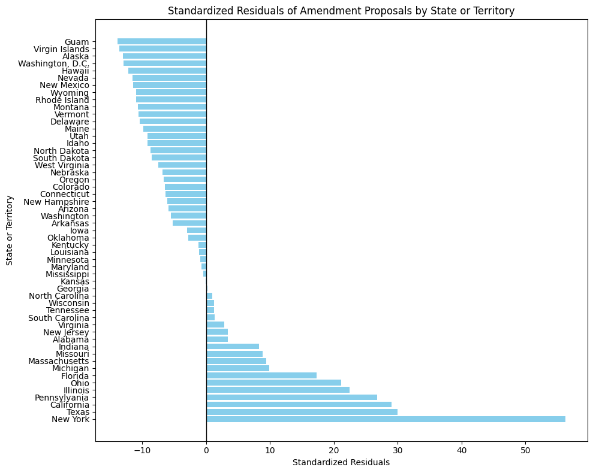

## Primary Analysis

Given that our goal is to see if the content of the amendments can show what century they were proposed in, an unsupervised learning model would work best for our purposes as it could recognize underlying patterns that can help group amendments together. Since we don't need to predict outcomes, but rather discover patterns, we choose a clustering algorithm as opposed to classification or regression. We picked K-means as our clustering algorithm because it's simple to implement, computationally efficient, and works well on large datasets such as ours. 

Since clustering algorithms have to sift through a high number of features, we will reduce the dimensionality (complexity) of the dataset and features. We decided to use PCA and t-SNE as our reduction techniques. PCA is ideal for reducing dimensionality because it preserves the most significant patterns in data by finding points of maximum variance. In the case of textual data which can be high dimensional, this is very helpful. Unlike PCA, t-SNE does well at visualizing non-linear relationships which is also helpful for working with textual data. Together these two reduction techniques allow us effectively process and visualize trends that will be found in K-means clustering.


```python
import pandas as pd
import re
def word_counter(text_series, common_words):
    word_counts = defaultdict(int) #default value for any key will be 0, no need to initialize each word
    for text in text_series:
        if pd.notna(text): # checking if cell is not empty
            for word in str(text).lower().split(): # split the string into words
                word = re.sub(r'[^a-zA-Z0-9]', '', word)
                if word and word not in common_words:
                    word_counts[word] += 1
    return word_counts
def create_word_century_dataframe(df_18th, df_19th, df_20th, df_21st, common_words):
  wct_18th = word_counter(df_18th['title_or_description_from_source'], common_words)
  wct_19th = word_counter(df_19th['title_or_description_from_source'], common_words)
  wct_20th = word_counter(df_20th['title_or_description_from_source'], common_words)
  wct_21st = word_counter(df_21st['title_or_description_from_source'], common_words)

  # Create a set of all unique words
  all_words = set(wct_18th.keys()).union(wct_19th.keys(), wct_20th.keys(), wct_21st.keys())

  # Create the dataframe
  data = []
  for word in all_words:
    data.append([word, wct_18th.get(word, 0), wct_19th.get(word, 0),
                 wct_20th.get(word, 0), wct_21st.get(word, 0)])

  df_word_century = pd.DataFrame(data,
                                 columns=['word', '18th', '19th', '20th', '21st'])

  return df_word_century
common_words = ["the", "a", "an", "and", "of", "to", "in", "is", "that", "it",
                "for", "with", "as", "on", "by", "be"]
df_word_century = create_word_century_dataframe(df_18th, df_19th, df_20th, df_21st, common_words)
df_word_century['id'] = df_word_century.index + 1
df_word_century
X = df_word_century.drop(['word', 'id'], axis=1)
y = df_word_century['word']
X_test, X_train, y_test, y_train = train_test_split(X, y, test_size=0.2, random_state=42)

```

Below, we want to guess the elbow point k based on the given data. The number of clusters can be anywhere between 1 to 10. We'll discover which number that should be in the code below.


```python
distortions = []
inertias = []
mapping1 = {}
mapping2 = {}
K = range(1, 10)

for k in K:

    # Building and fitting the model
    model_mean = KMeans(n_clusters=k).fit(X)
    # Append your distortion value
    distortion_value = sum(np.min(cdist(X, model_mean.cluster_centers_,
                                        'euclidean'), axis=1)) / X.shape[0]
    distortions.append(distortion_value)
    inertia_value = model_mean.inertia_
    inertias.append(inertia_value)
    # Save it to mapping1 and mapping2
    mapping1[k] = distortion_value
    mapping2[k] = inertia_value
# Plot

plt.plot(K, distortions, "go--")
plt.xlabel("K values")
plt.ylabel("Model's distortion")
plt.title("Elbow Method")
plt.show()


```


    
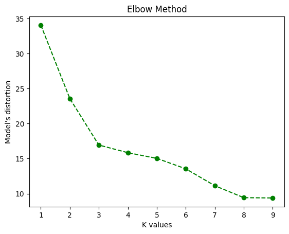
    


We can verify our conclusions above with KElbowVisualizer


```python
from sklearn import datasets
from sklearn.cluster import KMeans
import matplotlib.pyplot as plt
from yellowbrick.cluster import SilhouetteVisualizer
from yellowbrick.cluster import KElbowVisualizer

# Instantiate the clustering model and visualizer
model = KMeans()
visualizer = KElbowVisualizer(model, k=(1,10))
visualizer.fit(X)
visualizer.show()
```


    
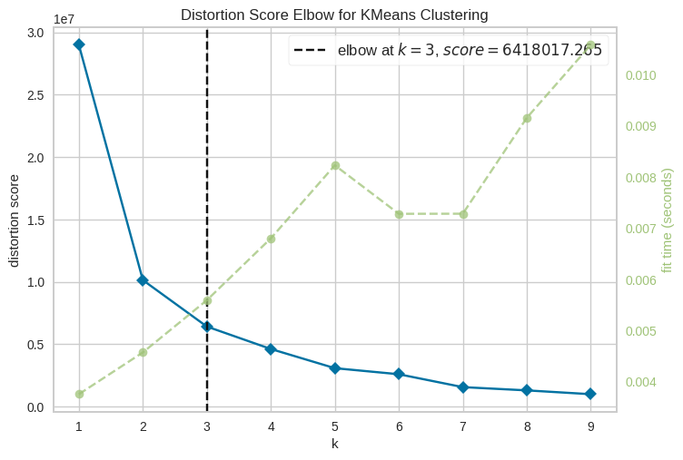
    


    <Axes: title={'center': 'Distortion Score Elbow for KMeans Clustering'}, xlabel='k', ylabel='distortion score'>


From the graph above, we have verified that we want K to be 3. When k is equal to 3, this indicates that it is the most optimal number of clusters. Afterwards, the values do not drop as much for the following k's.

Next we want to standardize the feature sets to make sure PCA or t-SNE is not biased by differences in scales within the  data.


```python
scaler = StandardScaler()

X_scaled = scaler.fit_transform(X)
X_scaled
```


    array([[-0.21279435, -0.16995953,  0.56904546,  0.28608658],
           [-0.21279435, -0.24011895, -0.17907357, -0.10565952],
           [-0.21279435, -0.09980011, -0.20899833,  0.00118033],
           ...,
           [-0.21279435, -0.16995953,  0.01044992, -0.10565952],
           [-0.21279435, -0.24011895, -0.19902341, -0.10565952],
           [-0.21279435, -0.24011895, -0.20899833, -0.10565952]])


Next, we want to apply PCA. PCA is a dimensionality reduction technique that finds principal components, thereby maximizing variance in a dataset.


```python
# This function applies PCA and returns the transformed data.

def apply_pca(X_scaled, n_components=2):
    pca = PCA(n_components)
    X_pca = pca.fit_transform(X_scaled)

    return pca, X_pca


pca, X_pca = apply_pca(X_scaled)
print(X_pca)
```

    [[ 0.27711069  0.50858744]
     [-0.36954838  0.09489809]
     [-0.26674173  0.1150519 ]
     ...
     [-0.22259748  0.11304414]
     [-0.38118383  0.0904905 ]
     [-0.38700155  0.0882867 ]]


After PCA, we also want to use t-SNE, which is a non-linear dimensionality reduction technique to visualize high-dimensional data. t-SNE preserves local structure, which is ideal for identifying clusters in complex datasets.


```python
# This function applies t-SNE and return the transformed data
seed = 42

def apply_tsne(X_scaled, n_components=2, random_state=seed):

    tsne = TSNE(n_components,random_state=seed)
    X_tsne = tsne.fit_transform(X_scaled)

    return tsne, X_tsne

# Apply t-SNE
tsne, X_tsne = apply_tsne(X_scaled)

```

Finally, we reach K-Means clustering, an unsupervised learning algorithm for clustering. It's goal is to partition data into K clusters based on feature similarity. The algorithm works by iteratively assigning data points to the nearest centroid (cluster center) and updating centroids to minimize the variance within each cluster. It starts by randomly initializing centroids and repeats the process until the centroids stabilize (convergence)


```python

k_cluster = 4


# TODO: Apply K-means clustering and return the cluster labels
def apply_kmeans(X, n_clusters, random_state=seed):
    means_model = KMeans(n_clusters, random_state=seed)
    fitted_model = means_model.fit(X)
    labels = fitted_model.labels_
    print(labels)
    return labels

# Apply K-means to both PCA and t-SNE results
pca_labels = apply_kmeans(X_pca, n_clusters = k_cluster)
tsne_labels = apply_kmeans(X_tsne, n_clusters = k_cluster)


## Visualization
def plot_clusters(X, labels, title, xlabel, ylabel):
    fig, ax = plt.subplots(figsize=(12, 8))

    df_word_century['Cluster'] = pd.Categorical(labels)

    # Get unique labels and corresponding colors
    unique_labels = df_word_century['Cluster'].unique()
    colors = sns.color_palette('viridis', n_colors=len(unique_labels))
    color_map = dict(zip(unique_labels, colors))

    # Create the scatter plot using sns.scatterplot
    sns.scatterplot(x=X[:, 0], y=X[:, 1], hue="Cluster", data=df_word_century,
                    s=45, palette=color_map, legend='full', ax=ax)

    # Customize legend to display century names
    handles, labels_legend = ax.get_legend_handles_labels()
    century_names = ['18th Century', '19th Century', '20th Century', '21st Century']
    ax.legend(handles=handles, labels=century_names[:len(labels_legend)],  # Use only necessary names
              title='Centuries')

    plt.title(title)
    plt.xlabel(xlabel)
    plt.ylabel(ylabel)
    plt.show()
#print(X_pca)
#print(X_pca.shape)

# Visualize PCA results
plot_clusters(X_pca, pca_labels,
              'PCA: Word Clusters Based on Century', 'PC1', 'PC2')

# Visualize t-SNE results
plot_clusters(X_tsne, tsne_labels,
              't-SNE:Word Clusters Based on Century', 't-SNE 1', 't-SNE 2')
```

    [0 0 0 ... 0 0 0]
    [2 0 1 ... 3 0 1]


## Visualization
    
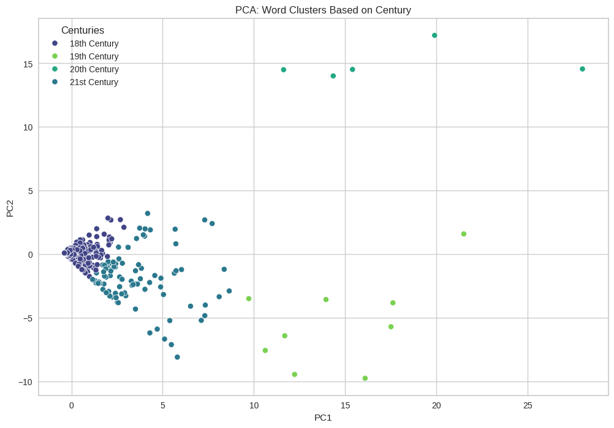
    


    
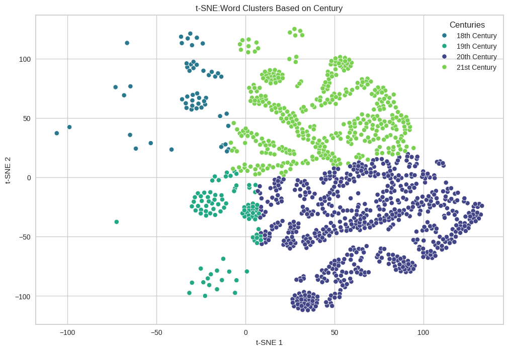
    


Using the elbow method, the analysis identifies the optimal number of clusters as three. The distortion scores decrease sharply up to k=3, after which the decline becomes more gradual. This suggests that the dataset, which consists of modern descriptions of constitutional amendments introduced in the U.S., can be grouped into three distinct thematic categories. These clusters likely reflect differences in the focus or subject matter of the amendments.

The PCA and t-SNE visualizations illustrate patterns within the dataset based on the century in which amendments were introduced. PCA shows relatively clear separability between clusters, while t-SNE highlights non-linear relationships among the data points. Descriptions of amendments introduced in the 18th and 19th centuries tend to form more cohesive clusters, potentially suggesting a narrower focus or more consistent themes for amendments from those time periods. In contrast, the descriptions of amendments introduced in the 20th and 21st centuries show more dispersed groupings, which may indicate a wider variety of amendment topics or a greater thematic complexity.

These results suggest possible shifts in the subject matter of constitutional amendments over time, though a more rigorous sentiment analysis could be useful to confirm this, taking into account not just the frequency of words, but also the words' meanings. The cohesion of earlier clusters, moreover, might reflect a focus on a more limited range of priorities in the 18th and 19th centuries, while the increasing overlap in later clusters might correspond to a broader or more interconnected set of issues addressed by more recent amendments.


## Conclusion